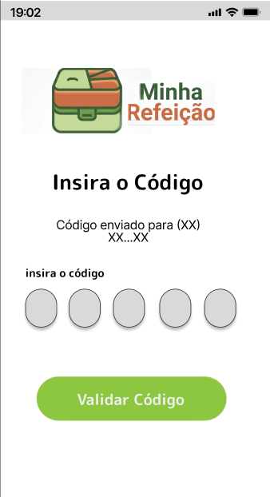
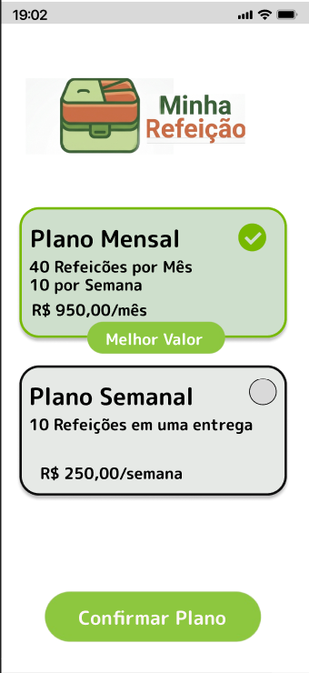
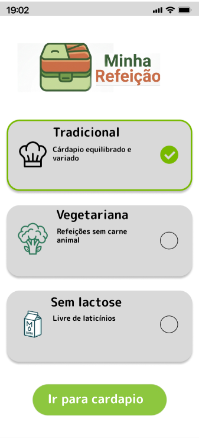
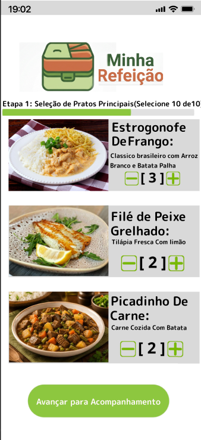
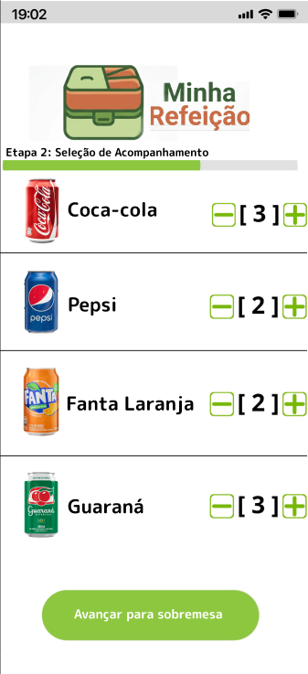
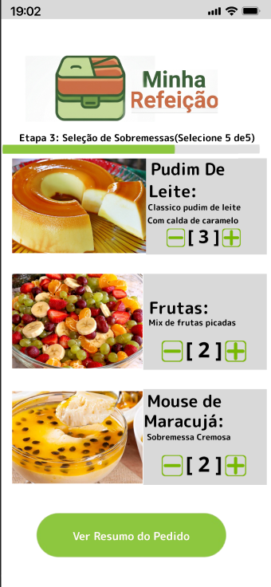
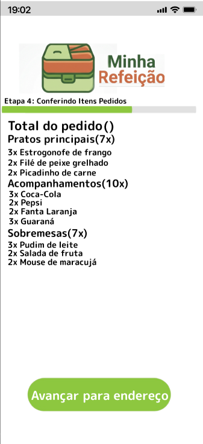
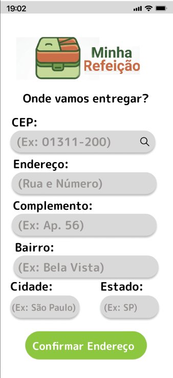
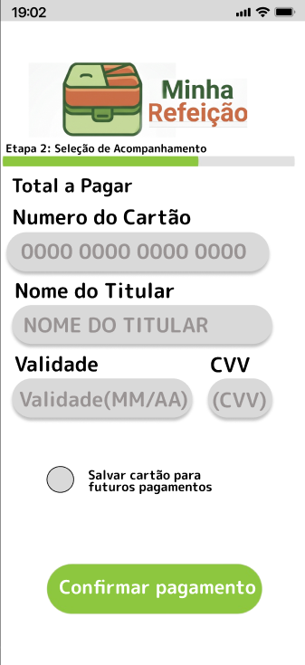
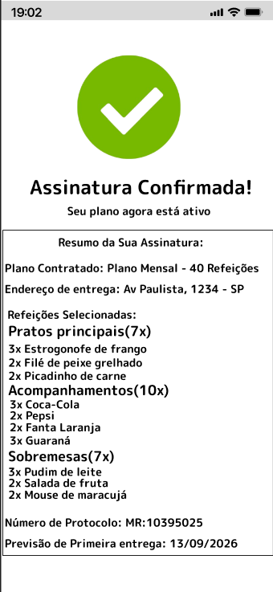

# Projeto: Plataforma Minha Refeição 

**Universidade Presbiteriana Mackenzie**
**Curso:** Ciência da Computação
**Disciplina:** Projeto de Software

---

## Visão Geral do Projeto
A plataforma **Minha Refeição** é um serviço de alimentação por assinatura que permite aos clientes receberem refeições prontas em casa. O sistema possibilita contratar planos de assinatura, definir a periodicidade, selecionar pratos e acompanhamentos, registrar preferências alimentares, informar endereço e efetuar o pagamento.

## Objetivo desta Entrega (Entrega 1)
Apresentar o protótipo e o fluxo de navegação principal (Caminho Feliz) para o cenário de negócio **Assinar Plano de Refeições**.
*   **Ator Principal:** Assinante.
*   **Ator Secundário:** Operadora de Cartão de Crédito.

## Links Importantes
*   **Protótipo Interativo (Figma):** https://www.figma.com/proto/nE7LPY0XSAsMsOTVRmASM5/Sistema-de-Marmitas?node-id=0-1&t=L64IPhfzMGAJaKjZ-1
*   **Vídeo de Apresentação:** https://youtu.be/fcTLTQqnB_o?is=irvL3N6QeavnBn63

## Fluxo de Navegação (Caminho Feliz)
A sequência de telas prototipada reflete estritamente os passos do fluxo principal:

**1. Tela de Autenticação**
*O usuário informa o seu número de celular para iniciar o acesso à plataforma.*

**2. Tela de Validação SMS**
*O sistema solicita o código de confirmação enviado por SMS e realiza a validação de segurança.*

**3. Tela de Planos de Assinatura**
*Apresentação dos planos disponíveis, detalhando a quantidade de refeições, a periodicidade de entrega e o valor do pacote.*

**4. Tela de Preferências Alimentares**
*Solicitação e armazenamento das restrições do cliente, com as opções: tradicional, vegetariana ou sem lactose.*

**5. Tela de Pratos Principais**
*Exibição e seleção dos pratos principais disponíveis no cardápio, filtrados pelas preferências informadas.*

**6. Tela de Acompanhamentos**
*Exibição e seleção das opções de acompanhamentos para compor as refeições.*

**7. Tela de Sobremesas**
*Exibição e seleção das opções de sobremesas disponíveis para o plano.*

**8. Tela de Resumo do Pedido**
*Apresentação da composição completa do pedido, agrupando os itens escolhidos para a conferência do assinante.*

**9. Tela de Endereço de Entrega**
*Formulário para o assinante informar, confirmar e armazenar o endereço onde as marmitas serão entregues.*

**10. Tela de Pagamento**
*Com a assinatura com status de Aguardando Pagamento, o sistema apresenta o valor total e solicita os dados do cartão de crédito.*

**11. Tela de Confirmação Final**
*Tela de sucesso gerada após a aprovação do pagamento, exibindo o número de protocolo gerado, o resumo do plano e a previsão da primeira entrega.*

---

## Equipe e Distribuição de Responsabilidades
*   **Renan Dos Santos Jesus (RA: 10748027)** Estruturação da WIKI e criação de telas.
*   **João Pedro Nascimento Simões (RA: 10427517)** Estruturação do fluxo no Figma e criação de telas.
